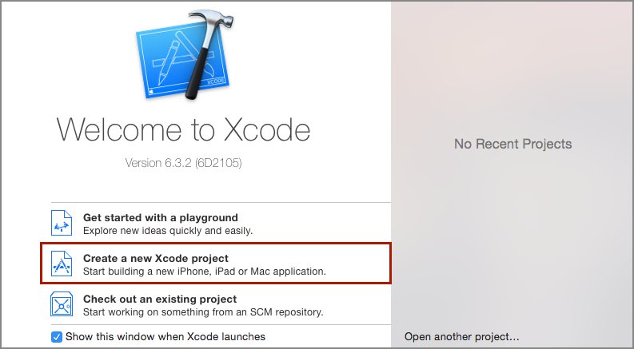
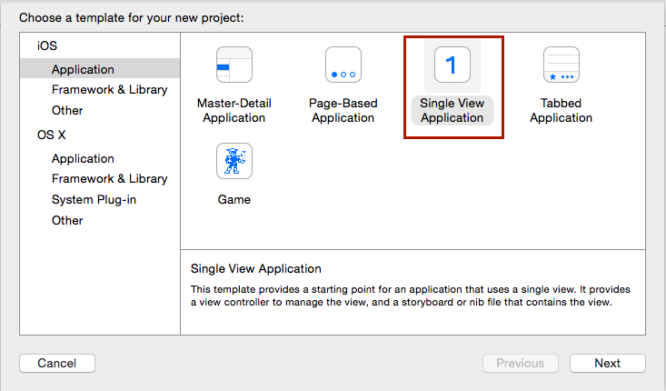
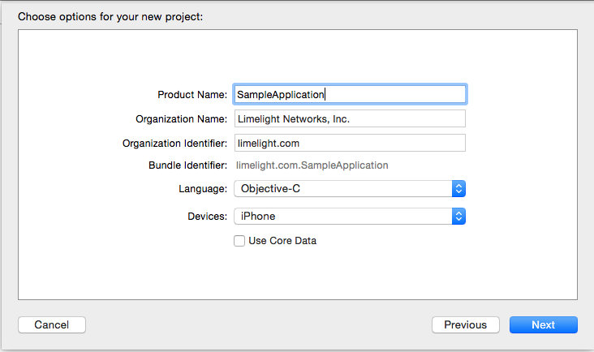

# Limelight Video Platform iOS SDK

## Installation

**To add LimelightVideoKit manually to your project use following steps.**

1.	Download LimelightVideoSDK for iOS from here (?)
2.	Add the Library and Headers folder to your project.
3.	In the “Build Phases” tab of your application target, add the following frameworks
  - ‘AVFoundation’
  -	‘CFNetwork’
  -	‘CoreData’
  -	‘CoreGraphics’
  -	‘CoreMedia’
  -	‘Foundation’
  -	‘MediaPlayer’
  -	‘MobileCoreServices’
  -	‘SystemConfiguration’
  -	‘UIKit’
  - ‘libLimelightVideoKitUniversal.a’

4.	On the “Build Settings” tab of your application target.
  -	Make sure that LimelightVideoKit SDK headers are in your application’s “Header Search Paths”.
  -	Add –ObjC to “Other Linker Flags”.
  
5.	Add following third party libraries to your project

|Library Name	|Version  |
|---------------|---------|
|AFNetworking	|1.3      |
|Base64nl	|1.1      |
|CocoaLumberjack|1.6      |
|Mantle 	|1.3.1    |
|OBSlider	|1.1      |
|Reachability	|3.1      |
|ReactiveCocoa  |2.1      |
|Widevine-iOS-SDK|6.0.0   |

Getting all these third party libraries manually is tedious task.
You can use CocoaPods to get these libraries.

Sample Podfile is as follows.
```
source 'https://github.com/CocoaPods/Specs.git' 
source 'git@github.llnw.net:llnw/PodSpecs.git' 

platform :ios, '8.0'  
xcodeproj '<Your_Project_Name>', 'Coverage' => :debug  

pod 'AFNetworking','~> 1.3' 
pod 'Base64nl', '~> 1.1' 
pod 'CocoaLumberJack', '~> 1.6' 
pod 'Mantle', '~> 1.3.1' 
pod 'OBSlider', '~>1.1' 
pod 'Reachability', '~>3.1' 
pod 'ReactiveCocoa', '~>2.1' 
pod 'Widevine-iOS-SDK', '~>6.0.0'
```
**To add LimelightVideoKit through CocoaPods** 

The easiest way to add the SDK and its dependencies to your project is to use CocoaPods. 
If you do not have CocoaPods installed, see the installation instructions on the [CocoaPods](https://guides.cocoapods.org/using/getting-started.html) site.

1. 	Use sample Podfile and install all the required pods by using command ‘pod install’ in your application project directory.
Sample Podfile is as follows
```
source 'https://github.com/CocoaPods/Specs.git'
source 'git@github.llnw.net:llnw/PodSpecs.git'

platform :ios, '8.0'

xcodeproj 'lvk-ios-integration', 'Coverage' => :debug

pod 'LimelightVideoKit', :git => 'https://github.llnw.net/llnw/limelight-sdk-ios.git'

# Remove 64-bit build architecture from Pods targets
post_install do |installer|
  installer.project.targets.each do |target|
    target.build_configurations.each do |configuration|
      target.build_settings(configuration.name)['ARCHS'] = '$(ARCHS_STANDARD_32_BIT)'
    end
  end
end
```

2.	In the “Build Phases” tab of your application target, add the following frameworks if missing
	- 	‘AVFoundation’
	-  	‘CFNetwork’
	-	‘CoreData’
	-	‘CoreGraphics’
	-	‘CoreMedia’
	-	‘Foundation’
	-	‘MediaPlayer’
	-	‘MobileCoreServices’
	-	‘SystemConfiguration’
	-	‘UIKit’


3.	 On the “Build Settings” tab of your application target:
	-     	 Add –ObjC to “Other Linker Flags”.


##How to create Simple Application using LimelightVideoSDK 

This tutorial helps you create basic application using LimelightVideoSDK to play a sample media.

There are two ways to try this Sample Application.

1.	Manually setup the project by following the steps below.
2.	Download the sample project as a starting point from Github
-	Get the entire project from here(Need to provide git repository link).
-	Run the ‘pod install’ command
-	Open and run the newly created workspace.

###Create the project in Xcode.
If you do not have it already please install Xcode 6 or later.

1.	Create a new project in Xcode.
        Open Xcode and you will see screen as below.



2.	Select **Single View Application** for the template and click **Next**.



3.	Set the project details as follows.
Product Name: SimpleApplication
Organization Name: <YourCompanyName>
Company Identifier:<com.yourcompany>



4.	Select the location where you want to save your project and click Create.
You can select checkbox in front of ‘Source Control’ if you want to create a git repository for your project.


5.	Now close the project as we need to install pods and after that we will use .xcworkspace file created by that.

###Adding SDK and setting up your project for dependencies
The easiest way to add the SDK and its dependencies to your project is to use   CocoaPods. If you do not have CocoaPods installed, see the installation instructions on the CocoaPods site.

6.	Use sample Podfile and install all the required pods by using command ‘pod install’ in your application project directory. 
You should see series of messages in the terminal saying that LimelightVideoKit along with other third party libraries required for the SDK are installed.

      Sample Podfile is as follows

```
source 'https://github.com/CocoaPods/Specs.git'
source 'git@github.llnw.net:llnw/PodSpecs.git'

platform :ios, '8.0'

xcodeproj 'SampleApplication', 'Coverage' => :debug

pod 'LimelightVideoKit', :git => 'https://github.llnw.net/llnw/limelight-sdk-ios.git'

# Remove 64-bit build architecture from Pods targets
post_install do |installer|
  installer.project.targets.each do |target|
    target.build_configurations.each do |configuration|
      target.build_settings(configuration.name)['ARCHS'] = '$(ARCHS_STANDARD_32_BIT)'
    end
  end
end
```

You should see following line as last line.

7.	[!] Please close any current Xcode sessions and use `SampleApplication.xcworkspace` for this project from now on.

The ‘pod install’ creates .xcworkspace file. This step onwards you should use .xcworkspace to open your project.

If you do not wish to use CocoaPods then add LimelightVideoKit manually to your project by using following steps

6.	Download LimelightVideoSDK for iOS from [here](https://github.llnw.net/llnw/limelight-sdk-ios/releases/tag/0.0.1).
7.	Add the Library and Headers folder to your project
8.	In the “Build Phases” tab of your application target, add the following frameworks
-	‘AVFoundation’
-	‘CFNetwork’
-	‘CoreData’
-	 ‘CoreGraphics’
-	‘CoreMedia’
-	‘Foundation’
-	‘MediaPlayer’
-	‘MobileCoreServices’
-	‘SystemConfiguration’
-	‘UIKit’
-	‘libLimelightVideoKitUniversal.a’

9.	On the “Build Settings” tab of your application target:
•	Make sure that LimelightVideoKit SDK headers are in your application’s “Header Search Paths”.
•	Add –ObjC to “Other Linker Flags”.

10.	Add following third party libraries to your project


|Library Name   |Version  |
|---------------|---------|
|AFNetworking   |1.3      |
|Base64nl       |1.1      |
|CocoaLumberjack|1.6      |
|Mantle         |1.3.1    |
|OBSlider       |1.1      |
|Reachability   |3.1      |
|ReactiveCocoa  |2.1      |
|Widevine-iOS-SDK|6.0.0   |

Getting all these third party libraries manually is tedious task.
You can use CocoaPods just to get these libraries.

Sample Podfile is as follows.

```
source 'https://github.com/CocoaPods/Specs.git' 
source 'git@github.llnw.net:llnw/PodSpecs.git' 

platform :ios, '8.0'  
xcodeproj '<Your_Project_Name>', 'Coverage' => :debug  

pod 'AFNetworking','~> 1.3' 
pod 'Base64nl', '~> 1.1' 
pod 'CocoaLumberJack', '~> 1.6' 
pod 'Mantle', '~> 1.3.1' 
pod 'OBSlider', '~>1.1' 
pod 'Reachability', '~>3.1' 
pod 'ReactiveCocoa', '~>2.1' 
pod 'Widevine-iOS-SDK', '~>6.0.0'
```
### Code the simple videoplayer application
You are just few steps away from playing sample media in your application.

1.	Open the SampleApplication.xcworkspace file in Xcode.
2.	Go to ‘Build Settings’ of your application and make sure the architectures is set ‘$(ARCHS_STANDARD_32_BIT) - $(ARCHS_STANDARD_32_BIT)’. If not then, set it to 32 bit. Please check the same thing for Pods build settings as well.
3.	Modify your ViewController implementation as given below.

-	In ViewController.m file create placeholder variables for media and library as 	below.
```
NSDictionary *media;
LVKLibrary *library;
```

-	Define initialization method to setup sample media and library.
	Here you would need to give your Limelight Video Account credentials and media ID.

```
+ (void)initialize {
    if(!media){
        media = @{@"Sample Media":@"722171d57d8f4b66862defbfb77e7096"};
    }
    if(!library){
      library = [LVKLibrary 	libraryWithOrganizationId:@"f3008f5093b2471ea25ae270927bdefc"
                                    	accessKey:@"Ft7epGLo37scuCq7Ln23OMyq8hk="
                                                 	secret:@"cSspsyMDzVtQcMVfgqmhvf54hr4="];   }
}
```

-	In viewDidLoad, add following code.
```
[library fetchMediaForId:media[@"Sample Media"]
                     success:^(LVKMedia *media) {
                         LVKPlayerViewController *pvc = [LVKPlayerViewController playerForMedia:media];
                         [pvc.player prepareToPlay];
                         UINavigationController *nav = [[UINavigationController alloc] initWithRootViewController:pvc];
                         [self presentViewController:nav animated:YES completion:^{
                             NSLog(@"Player Successfully Loaded");
                         }];
                     } failure:^(NSError *error) {
                         NSLog(@"Media fetch error: %@", error);
                     }];
```

4.	Run the application and you should be able to play the sample video.


